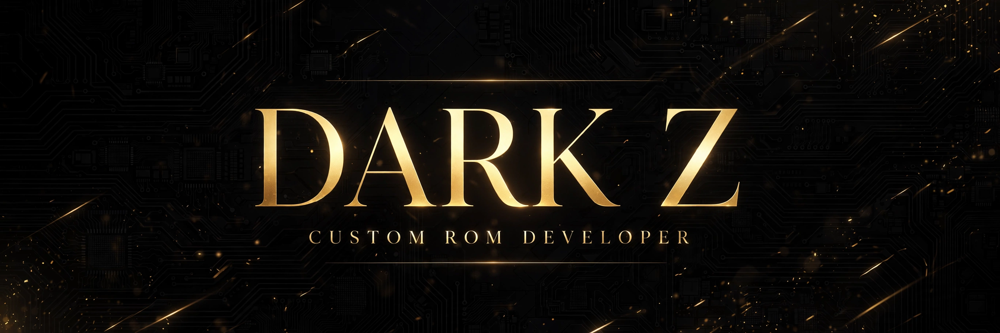

<!-- markdownlint-disable MD033 MD041 -->

<div align="center">




<br/>


</div>

---

<div align="center">

## ✦ About ✦

</div>

```yaml
name:     "Dark Z"
aka:      "Night Stalker"
craft:    Custom Android ROMs — device trees, vendor trees, kernels, recoveries
silicon:  MediaTek Helio G99 (MT6789) · Infinix / Transsion
focus:    Android 16 & 17 bring-up · OTA update infrastructure
motto:    git commit -m "make it better"
```

<div align="center">

<i>I take phones that shipped with mediocre software and give them the builds they deserved from day one.<br/>Device bring-up, SELinux policy, HAL integration, recovery trees, and the OTA pipeline that ships it all — end to end, solo.</i>

</div>

---

<div align="center">

## ✦ Currently Forging ✦

<br/>

🔥 **Android 17 (LineageOS 24)** — Infinix HOT 40 Pro (X6837) bring-up<br/>
🛠️ **Android 16** — maintaining trees for HOT 40 Pro & NOTE 12 2023 (X676C)<br/>
📡 **OTA infrastructure** — update_engine · Infinity X updater

</div>

---

<div align="center">

## ✦ Arsenal ✦

<br/>


</div>

---

<div align="center">

## ✦ Featured Work ✦

</div>

| Project | Description |
|:--------|:------------|
| **[device_infinix_X6837](https://github.com/god-dark-z/device_infinix_X6837)** | 📱 Device tree — Infinix HOT 40 Pro · Android 16 / 17 |
| **[vendor_infinix_X6837](https://github.com/god-dark-z/vendor_infinix_X6837)** | 📦 Vendor tree — Infinix HOT 40 Pro |
| **[android_device_infinix_X676C](https://github.com/god-dark-z/android_device_infinix_X676C)** | 📱 Device tree — Infinix NOTE 12 2023 · Android 16 |
| **[android_vendor_infinix_X676C](https://github.com/god-dark-z/android_vendor_infinix_X676C)** | 📦 Vendor tree — Infinix NOTE 12 2023 |
| **[twrp-device_infinix_Infinix-X676C](https://github.com/god-dark-z/twrp-device_infinix_Infinix-X676C)** | 🔧 TWRP recovery — NOTE 12 2023 |
| **[ofox-device_infinix_Infinix-X676C](https://github.com/god-dark-z/ofox-device_infinix_Infinix-X676C)** | 🦊 OrangeFox recovery — NOTE 12 2023 |
| **[Infinity-X-Unofficial-X6837-Updater](https://github.com/god-dark-z/Infinity-X-Unofficial-X6837-Updater)** | 📡 OTA updater — Infinity X · HOT 40 Pro |

---

<div align="center">

## ✦ Stats ✦

<br/>


<br/>


<br/>


</div>

---

<div align="center">

## ✦ Connect ✦

<br/>

<a href="https://github.com/god-dark-z"></a>
<a href="https://t.me/god_dark_z"></a>

<br/><br/>


<br/>

<sub>© 2026 Dark Z · Crafted, not templated.</sub>

</div>
